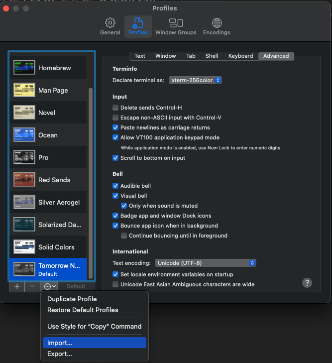
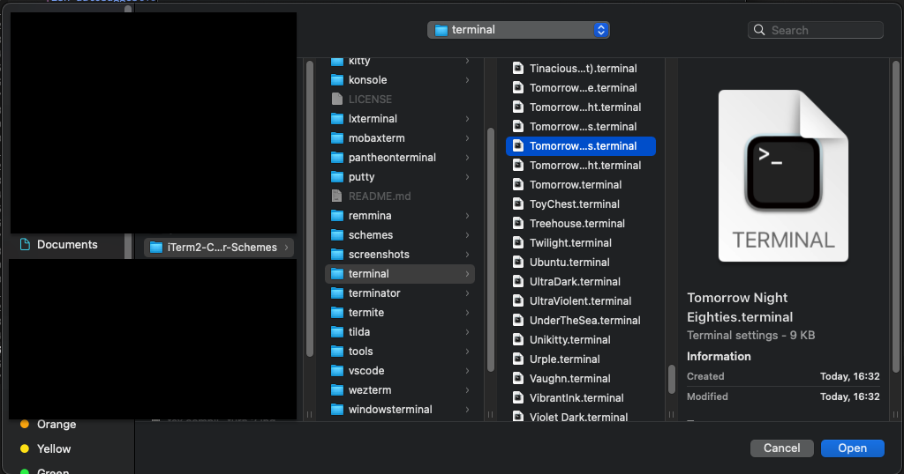
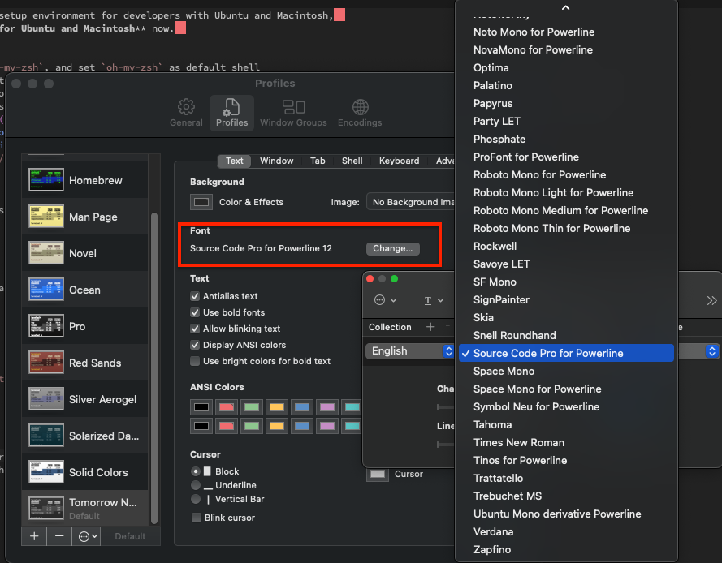

This script is used to setup environment for developers with Ubuntu and Macintosh,  
and is **only availabe for Ubuntu and Macintosh** now.  

# Features
* Install `zsh` and `oh-my-zsh`, and set `oh-my-zsh` as default shell
* Install powerline fonts
* Download terminal color scheme ([iTerm2-Color-Schemes](https://github.com/mbadolato/iTerm2-Color-Schemes)) to user home directory
* Install some useful zsh plugins, including
    * [zsh-completions](https://github.com/zsh-users/zsh-completions)
    * [zsh-autosuggestions](https://github.com/zsh-users/zsh-autosuggestions)
    * [zsh-syntax-highlighting](https://github.com/zsh-users/zsh-syntax-highlighting)
    * [autojump](https://github.com/wting/autojump)

# Install
For Mac users,  
please have Homebrew installed.

1. Install
```
./install.sh
```
2. Modify `~/zshrc`, chang `ZSH_THEME` and `plugins` as below:
```
...
ZSH_THEME="agnoster"
...
plugins=(
	zsh-completions
	zsh-syntax-highlighting
	zsh-autosuggestions
	autojump
)
...
```
3. Go to terminal preferences and chose a color scheme to import





4. Change the font of the terminal to one of the downloaded powerline fonts



5. Happy journey
